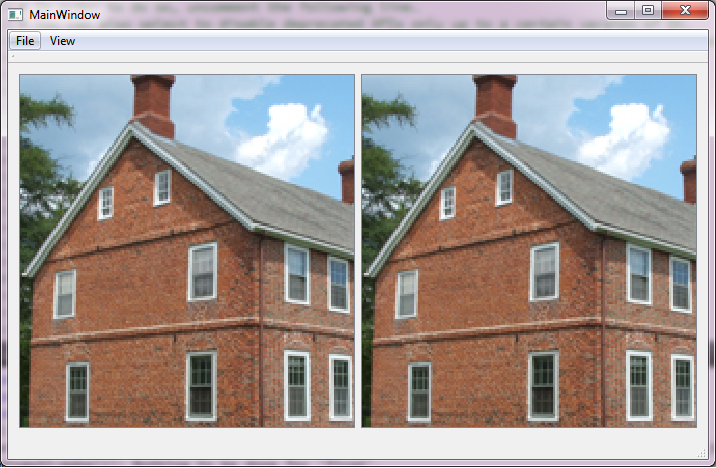

## twoView
Concurrent zoom and pan in multiple QGraphicsView (Qt)

### DESCRIPTION

A Qt application showing how to simultanious zoom and pan in multiple QGraphicsView.

Mouse wheel is used for zooming and mouse middle button is used to pan. Can be used in etiher of the view's.

### DOWNLOAD
Source are in the _root_ directory. Windows setup are in the 'bin' directory.

[MS Windows (Installer)](bin/setup.exe)

